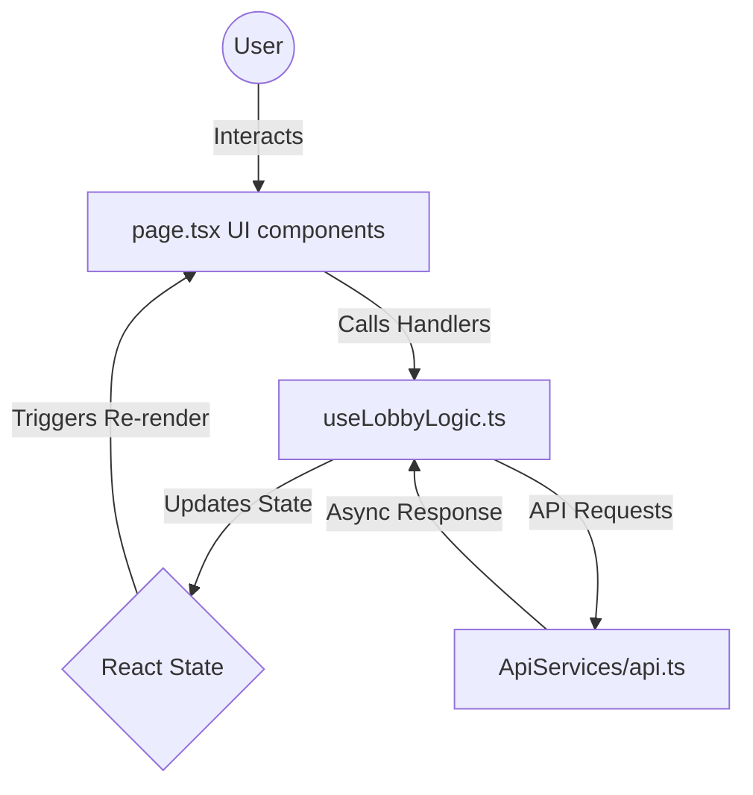

# Architecture & Refactor Report: Lobby Modularization

## 1. Specifications & Purpose ("Kya kar raha hai & Kyu?")

**Goal:** The objective was to clean up the `GlassLobby` (Main Page) component, which had become a "God Component"—handling complex state (networking, countdowns, tabs, inputs) *and* complex UI rendering simultaneously.

**What it does now:**
-   **Separation of Concerns:** We separated the **Brain** (Logic) from the **Body** (UI).
-   **Logic Hook (`useLobbyLogic`)**: Handles *how* things work (API calls, state updates, validation).
-   **UI Components (`LobbyTabs`, etc.)**: Handle *how* things look (Styles, Layout).

**Why (The "Why" Factor):**
-   **Readability:** You can now read `page.tsx` and instantly see the structure of the page without scrolling through 100 lines of `useEffect` and `fetch`.
-   **Reusability:** The `RoomLinkSection` or `PlayerPreview` could potentially be reused or moved without breaking the main page logic.
-   **Debuggability:** If the "Join" button breaks, you check `useLobbyLogic`. If the "Join" button looks wrong, you check `page.tsx` or `LobbyTabs`.

---

## 2. Ugly vs. Optimal Way

### The "Ugly" Way (Previous Monolithic Approach)
In the old version, `page.tsx` contained:
-   **Mixed Responsibilities:** `useEffect` for countdowns mixed with `
` for rendering avatars.
-   **State Explosion:** 10+ `useState` calls cluttering the top of the component.
-   **Spaghetti Code:** To find where the "Join" logic happened, you had to scroll past 200 lines of CSS-in-JS and JSX.
-   **Risk:** Changing a style could accidentally break a logic variable if they were intertwined in a large file.

### The "Optimal" Way (Current Modular Architecture)
We implemented a **Container/Presenter Pattern** (via Hooks):
-   **`useLobbyLogic` (The Container/Controller):**
    -   Pure TypeScript/React Logic.
    -   Zero JSX/Rendering.
    -   Returns: `{ activeTab, handleSubmit, isLoading, ... }`
    -   *Spec:* Input: User interactions. Output: State & Side Effects (Navigation/Toast).
-   **`GameScene/*` Components (The Presenters):**
    -   Pure UI (Dumb Components).
    -   Receive data via **Props**.
    -   Don't know *how* to join a room, they just call `props.onChange` or `props.onCopy`.
-   **`page.tsx` (The Composer):**
    -   Imports the Logic.
    -   Imports the UI.
    -   Connects them: `<RoomLinkSection slug={createdRoomSlug} ... />`

---

## 3. Data Flow Specs ("How the data transfer")

The data flows **Unidirectionally** (One way flow), ensuring predictability.

### A. State Initialization (The Hook)
1.  `useLobbyLogic` initializes state:
    -   `name` = ""
    -   `avatarId` = 1
2.  It exposes these values + setter functions (`setName`, `setAvatarId`).

### B. The Composer (`page.tsx`)                
1.  Calls the hook: `const logic = useLobbyLogic();`
2.  Extracts the values: `logic.name`, `logic.avatarId`.

### C. Props Down (The Rendering)
1.  **Avatar Selection**:
    -   `page.tsx` passes `value={logic.avatarId}` and `onChange={logic.setAvatarId}` to `<AvatarGrid />`.
    -   When User clicks an avatar -> `<AvatarGrid>` calls `onChange(2)` -> `useLobbyLogic` updates state -> App re-renders.
2.  **Room Link**:
    -   `page.tsx` passes `slug={logic.createdRoomSlug}` to `<RoomLinkSection />`.
    -   If `slug` is null, `RoomLinkSection` shows "Preview". If valid, it shows the "Copy" UI.
    -   Logic decides *what* the slug is; UI decides *how* to show it.

## 4. File Specs

### `apps/web/Hooks/useLobbyLogic.ts`
-   **Dependencies:** `next/navigation` (Router), `react-hot-toast`, `api.ts`.
-   **Outputs:** Object containing all form state and event handlers.

### `apps/web/Components/GameScene/PlayerPreview.tsx`
-   **Inputs:** `avatarId` (Int), `name` (String), `activeTab` ('create'|'join').
-   **Logic:** Finds the usage of `AVATARS` constant to display the correct image. Handles the "Host/Guest" badge display.

### `apps/web/Components/GameScene/RoomLinkSection.tsx`
-   **Inputs:** `slug` (String|Null), `isCopied` (Bool).
-   **Logic:** Conditional rendering. If `slug` exists -> Green "Ready" state. If not -> Gray "Preview" state.

This structure allows "Scribble" to scale. If we want to add a "Spectator Mode" later, we just add a state to the Hook and a UI component, without rewriting the entire page layout.
